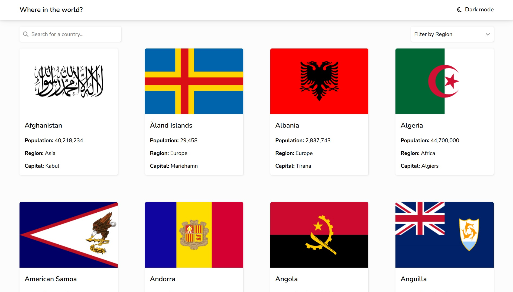

# Frontend Mentor - REST Countries API with color theme switcher solution

With this app, you can view and search for information about every country in the world.
It uses the REST Countries API and was built with React.

## Overview

### The challenge

Users should be able to:

- See all countries from the API on the homepage
- Search for a country using an `input` field
- Filter countries by region
- Click on a country to see more detailed information on a separate page
- Click through to the border countries on the detail page
- Toggle the color scheme between light and dark mode

### Screenshot

### Links

- Solution URL: https://github.com/guillemfrasquet/countries-app
- Live Site URL: https://guillemfrasquet.github.io/countries-app/

## My process

### Built with

- Semantic HTML5 markup
- CSS custom properties
- Flexbox
- CSS Grid
- [React](https://reactjs.org/) - JS library

## Author

- Frontend Mentor - [@guillemfrasquet](https://www.frontendmentor.io/profile/guillemfrasquet)
